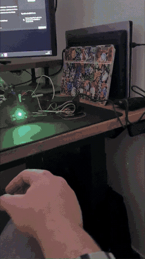
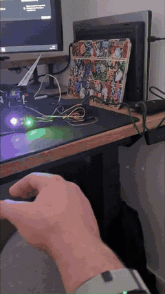
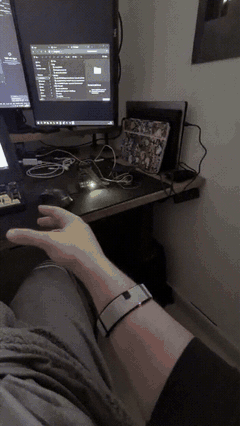
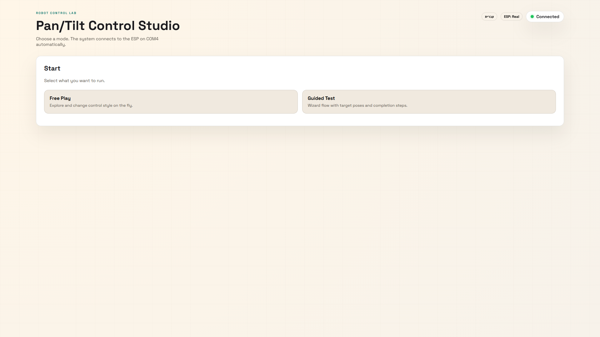
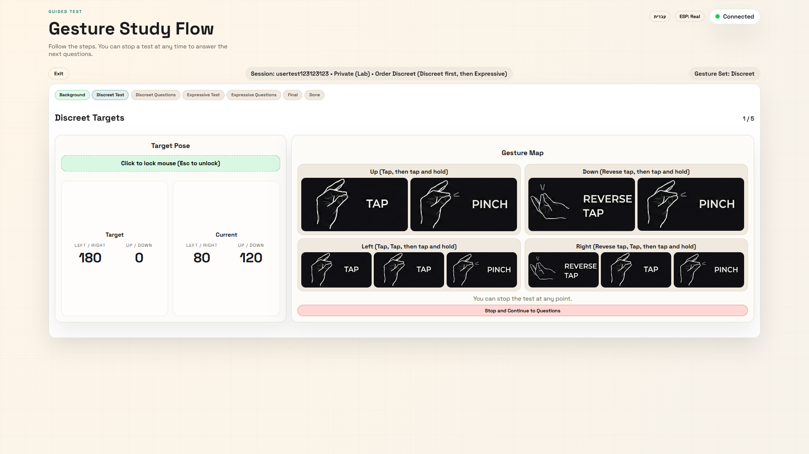
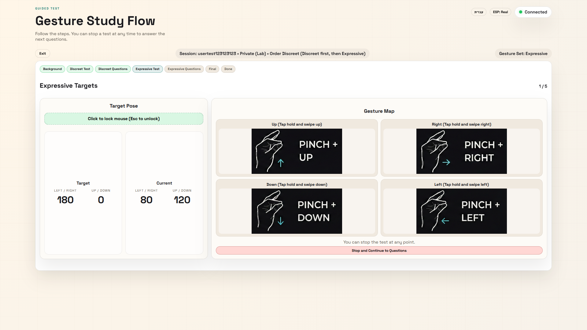
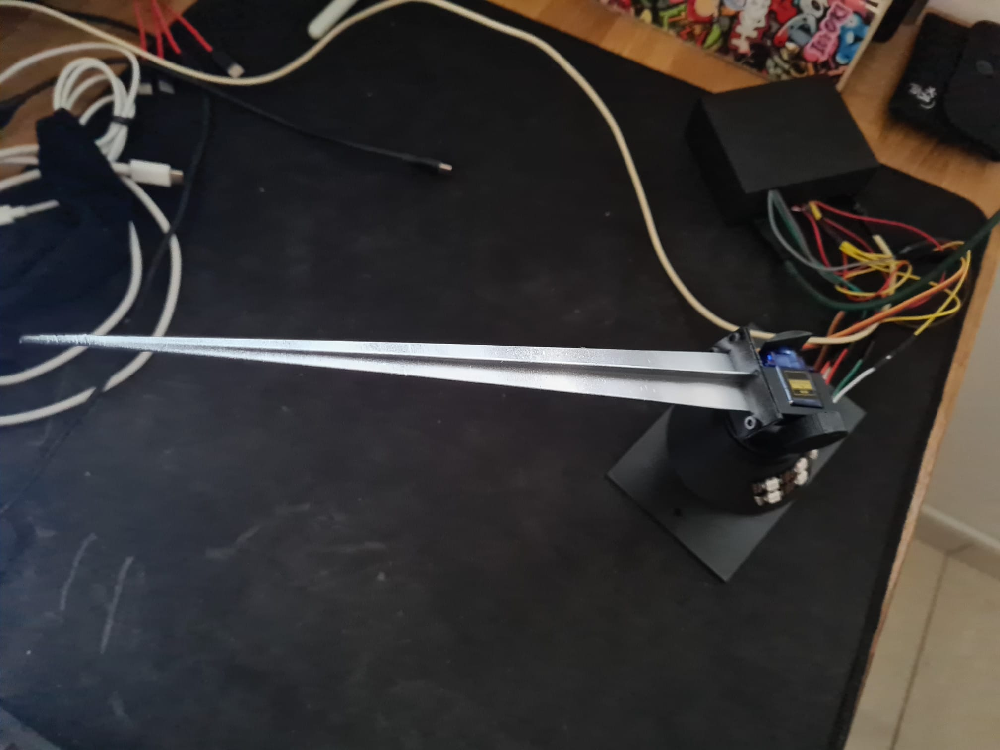
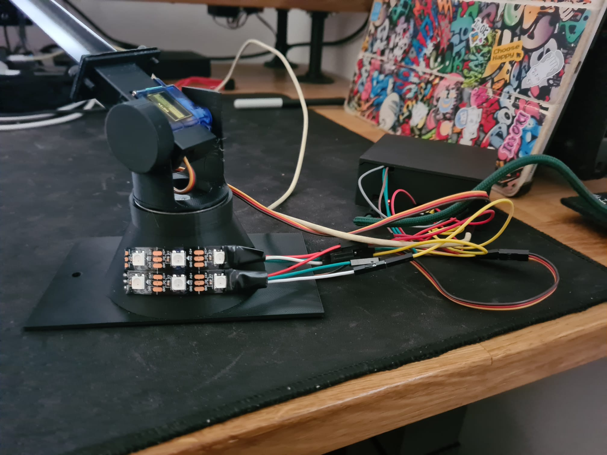
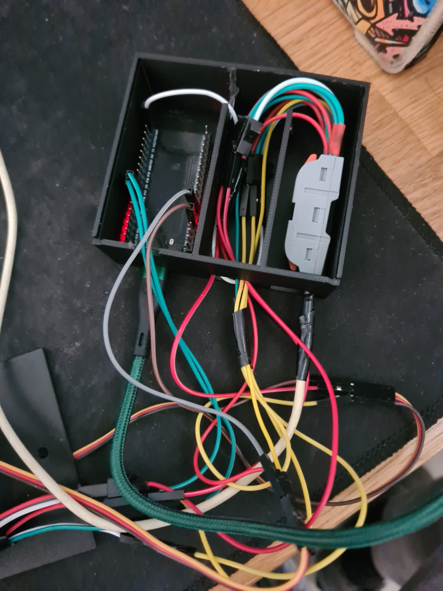
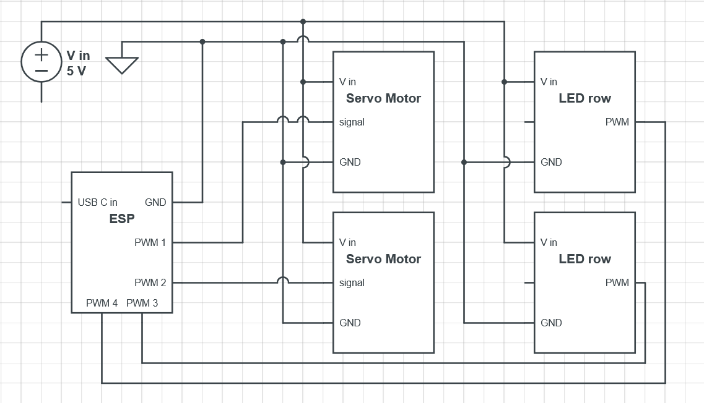

# Discreet vs. Expressive Gestures for Public Robot Control (HCI Project)

This repository contains a complete, end-to-end HCI study prototype for comparing **discreet** vs **expressive** gesture sets while controlling a visible **2-DOF pan/tilt robot**, plus the study materials (paper/report), CAD, media, and analysis pipeline.

The system is built around:
- An **ESP32-based** pan/tilt robot (servo + NeoPixel feedback) + firmware (`pan-tilt/`)
- A **Python FastAPI web server** for control + logging (`server.py`)
- A **static web UI** served by the server (`web-ui/`)
- A **results analysis script** that aggregates logs and generates paper-ready plots (`analyze_results.py`)
- The **LaTeX report/paper** and all figures/tables (`report/`)

---

## Quick start (Windows / PowerShell)

```powershell
python -m venv .venv
.\.venv\Scripts\Activate.ps1
python -m pip install -r requirements.txt
uvicorn server:app --host 127.0.0.1 --port 8000
```

Open `http://127.0.0.1:8000/`.

If no ESP is connected, change the mod of run to simulated by pressing the "ESP: Real" button next to connectivity status on the top right.
To use the ESP, make sure it is set to "ESP: Real".

---

## Repository layout

### Core code
- `server.py` - FastAPI server; serves the UI, connects to the ESP32 over serial, runs guided tests, and logs runs.
- `control.py` - simple CLI for controlling the pan/tilt device directly over serial (command/keyboard/gesture-mapped input).
- `input_providers.py` - input abstractions used by `control.py` (keyboard + gesture-mapped sources).
- `analyze_results.py` - aggregates `test-results/` (or `test-runs/`) into `*.json` exports + `*.pdf/*.png` plots.

### Study & writing
- `report/` - LaTeX paper/report + all figures and tables.
  - `report/main.tex` - main manuscript.
  - `report/tables/` - LaTeX tables (study design overview, questionnaire blocks, gesture set, ...).
  - `report/figures/raw/` - raw assets used in the report (robot photos, UI images, diagrams).
  - `report/figures/plots/` - generated plots used by the report (see "Analysis & plots" below).

### Hardware & media
- `pan-tilt/` - PlatformIO firmware for the ESP32-based pan/tilt robot.
- `CAD/` - STL files for 3D-printed parts of the robot enclosure / mount.
- `docs/` - demo videos and documentation images.
  - `docs/vid/` - videos of the robot moving during the study.
  - `docs/web-server/` - screenshots of the web UI and study flow pages.

### Local / study data (not committed)
- `test-runs/` - raw run logs produced by the server during pilot/study runs.
- `test-results/` - the dataset used for plotting/reporting (same structure as `test-runs/`, but curated).
- `figures/` - default output folder for `analyze_results.py` when not writing directly into `report/figures/`.

Note: `test-runs/`, `test-results/`, and `figures/` are listed in `.gitignore` by default (privacy + size).

---

## Demo media

- Robot motion videos: `docs/vid/`
- Web UI screenshots: `docs/web-server/`

Side-by-side comparison clips:

<table>
  <thead>
    <tr>
      <th>Command</th>
      <th>Discreet</th>
      <th>Expressive</th>
    </tr>
  </thead>
  <tbody>
    <tr>
      <td>Up</td>
      <td></td>
      <td></td>
    </tr>
    <tr>
      <td>Right</td>
      <td></td>
      <td></td>
    </tr>
  </tbody>
</table>

Web screenshots:





---

## Hardware (robot) overview

The robot is a **2-DOF pan/tilt mechanism** driven by an ESP32 running Arduino firmware (`pan-tilt/`). The firmware exposes a small serial command protocol used by both:
- `control.py` (direct CLI control), and
- `server.py` (web UI + guided test + logging).

3D-printable parts live in `CAD/` as STL files.





---

## Firmware: `pan-tilt/` (PlatformIO)

Prerequisites:
- PlatformIO (VS Code extension or `pio` CLI)
- An ESP32 dev board configured as `esp32dev` (see `pan-tilt/platformio.ini`)

Common commands (from the repo root, or `cd pan-tilt`):
```bash
pio run
pio run -t upload
pio device monitor
```

The firmware is configured for `115200` baud (`monitor_speed = 115200`).

---

## Python server + web UI

### Install dependencies

This repo uses Python for the web server and control scripts.

```bash
python -m pip install -r requirements.txt
```

### Run the server

The server is a FastAPI app (`app = FastAPI()` inside `server.py`). Run it with Uvicorn:
```bash
uvicorn server:app --host 127.0.0.1 --port 8000
```

Then open:
- `http://127.0.0.1:8000/` (the static UI served from `web-ui/`)

By default the UI/server try to auto-connect to the device on a Windows serial port (default is `COM4`; see `DEFAULT_PORT` in `server.py`).

### Simulated mode (no hardware)

The server supports a simulated serial device (see `DEFAULT_DEVICE_MODE` / device-mode toggles in the UI). Use this to demo the UI flow and logging without connecting real hardware.

### Running a guided test session (high level)

The web UI has two main modes:
- **Free Play**: explore control and switch presets without the full study wizard.
- **Guided Test**: runs the study flow and creates a structured log folder under `test-runs/`.

Typical workflow:
1. Start the server (`uvicorn server:app ...`).
2. Open `http://127.0.0.1:8000/` and choose **Guided Test**.
3. Enter the participant/session info (participant ID, environment/context, condition order).
4. Run the target sequence (5 sequential targets) for each block and complete the post-block questionnaire.
5. At the end, the server saves a session folder to `test-runs/<participant>_<uuid>/`.
6. Copy/curate folders into `test-results/` when you want a stable dataset for analysis/reporting.

---

## Direct serial control (CLI)

If you want to bypass the web UI and send commands directly:

```bash
python control.py COM4
```

Command examples (as printed by `control.py`):
- `P120 T70` (set pan/tilt)
- `HOME` (return to default home pose)
- `STATUS` (query current pose)
- `CENTER <pan> <tilt>` (center/calibrate - used by the firmware)

Keyboard control mode:
```bash
python control.py COM4 --input keyboard --step 4
```

Gesture-mapped control mode (stdin gesture names):
```bash
python control.py COM4 --input gestures --gesture-source stdin
```

---

## Data logging format (`test-runs/` / `test-results/`)

Each session is stored under a folder named like:
```
<participantId>_<uuid>/
```

Inside, you typically get:
- `questions.json` - consent, demographics, block questionnaires, final questionnaire.
- One run JSON per condition block (e.g.):
  - `discreet_private.json`
  - `discreet_public.json`
  - `expressive_private.json`
  - `expressive_public.json`

Each run JSON includes:
- the target plan (`targets`),
- per-target completion summaries (`results`),
- continuous event logging (`events`),
- early-stop info (`reason`, `current_target_index`, `current_target_elapsed`),
- and a copy of the block questionnaire when available (`block_questionnaire`).

---

## Analysis & plots (`analyze_results.py`)

### Install analysis dependencies

The analysis script intentionally keeps core server deps minimal; plotting needs extra packages:

```bash
python -m pip install matplotlib numpy pandas seaborn
```

### Generate plots for the report

To regenerate the plots that `report/main.tex` includes:
```bash
python analyze_results.py --results-dir test-results --out-dir report/figures
```

Outputs:
- `report/figures/data/` - exported JSON tables (`participants.json`, `blocks.json`, `targets.json`, ...)
- `report/figures/plots/` - plots as both `*.pdf` and `*.png`
- `report/figures/figures_manifest.json` - plot manifest (filenames + descriptions)

### Target-by-target progress plots (partial blocks)

Some participants stopped early during discreet performance. To ensure these blocks are still counted (and visibly shown), the analysis generates **progress-to-target-N** plots with explicit "partial/stopped" bars:
- `report/figures/plots/time_to_targets_progress_by_preset.pdf`
- `report/figures/plots/gestures_to_targets_progress_by_preset.pdf`

These plots show **targets 1-5** (not just "first N targets"), and hatched bars denote partial progress on the attempted target where the block ended.

---

## Report / paper (`report/`)

The manuscript lives at `report/main.tex` and includes plots from `report/figures/plots/` and in the root `report.pdf`.

